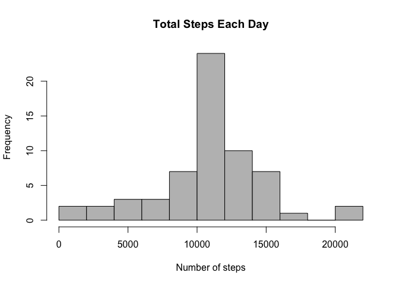

Reproducible Research Assignment #1
==============================================
**Load and preprocess the data**


```r
df <- read.csv("activity.csv", header=TRUE)
```

**Make a histogram of the total number of steps taken each day**


```r
df_no_na <- na.omit(df)
df_steps_by_date <- aggregate(df_no_na$steps, by=list(df_no_na$date), FUN=sum)
names(df_steps_by_date) <- c("date", "steps")
hist(df_steps_by_date$steps, 
     main="Total Steps Each Day (NAs removed)", 
     col="grey", 
     xlab="Number of steps",
     breaks=10)
```

 

**Calculate and report the mean and median total number of steps taken per day**


```r
meanvalue <- mean(df_steps_by_date$steps)
medianvalue <- median(df_steps_by_date$steps)
```

Mean value is 10766

Median value is 10765

**Report average daily activity pattern**

```r
df_steps_by_interval <- aggregate(df_no_na$steps, by=list(df_no_na$interval), FUN=mean)
names(df_steps_by_interval) <- c("interval", "mean_steps")
```

*Time series plot of the 5-minute interval (x-axis) and the average number of steps taken, averaged across all days (y-axis)*

```r
plot(df_steps_by_interval$interval,
     df_steps_by_interval$mean_steps, 
     type="l", 
     xlab="5-minute interval", 
     ylab="Average steps taken",
     main="Average number of steps per day by interval")
```

 

*Which 5-minute interval, on average across all the days in the dataset, contains the maximum number of steps?*

```r
maxvalue <- max(df_steps_by_interval$mean_steps)
maxvalue_interval <- df_steps_by_interval[df_steps_by_interval$mean_steps == maxvalue,]
```

5-minute interval with maximum number of steps: 835

Number of steps in that interval: 206.17

**Impute missing values**

*Calculate and report the total number of missing values in the dataset (i.e. the total number of rows with NAs)*

```r
number_na_rows <- sum(is.na(df$steps)) 
```
Number of rows with NAs: 2304

*Devise a strategy for filling in all of the missing values in the dataset*

We will use mean for that 5-minute interval to assign values to missing data.

*Create a new dataset that is equal to the original dataset but with the missing data filled in.*

```r
#df_na_filled <- df
na_rows <- is.na(df$steps)
df_na_filled <- transform(df, 
                          steps = ifelse(is.na(df$steps), 
                                         df_steps_by_interval$mean_steps[match(df$interval, 
                                                                          df_steps_by_interval$interval)], 
                                         df$steps))
```

*Make a histogram of the total number of steps taken each day and Calculate and report the mean and median total number of steps taken per day.*

```r
new_df_steps_by_date <- aggregate(df_na_filled$steps, by=list(df_na_filled$date), FUN=sum)
names(new_df_steps_by_date) <- c("date", "steps")
hist(new_df_steps_by_date$steps, 
     main="Total Steps Each Day", 
     col="grey", 
     xlab="Number of steps",
     breaks=10)
```

 

```r
new_meanvalue <- mean(new_df_steps_by_date$steps)
new_medianvalue <- median(new_df_steps_by_date$steps)
```

With missing values imputed, mean is 10766; median is 10766.

*Do these values differ from the estimates from the first part of the assignment?* 

Mean value is the same. Median value is seen approaching mean value after missing values are imputed with mean values of intervals.

*What is the impact of imputing missing data on the estimates of the total daily number of steps?*

We notice higher frequency counts in the portion of histogram around the mean value of 10766.

**Are there differences in activity patterns between weekdays and weekends?**

*Create a new factor variable in the dataset with two levels – “weekday” and “weekend” indicating whether a given date is a weekday or weekend day.*

```r
df_na_filled$week <- weekdays(as.Date(df_na_filled$date))
new_df <- transform(df_na_filled, 
                    week=ifelse((df_na_filled$week=="Saturday")|(df_na_filled$week=="Sunday"),
                    "weekend", 
                    "weekday"))
```

*Make a panel plot containing a time series plot (i.e. type = "l") of the 5-minute interval (x-axis) and the average number of steps taken, averaged across all weekday days or weekend days (y-axis).*

```r
library(lattice)
plot_new_df <- aggregate(new_df$steps, by=list(new_df$interval, new_df$week), FUN=mean)
names(plot_new_df) <- c("interval", "week", "steps")
xyplot(steps ~ interval|week,
       layout = c(1, 2),
       main="Average steps per day by interval",
       xlab="5-minute interval",
       ylab="Number of steps",
       type="l",
       data=plot_new_df)
```

 
